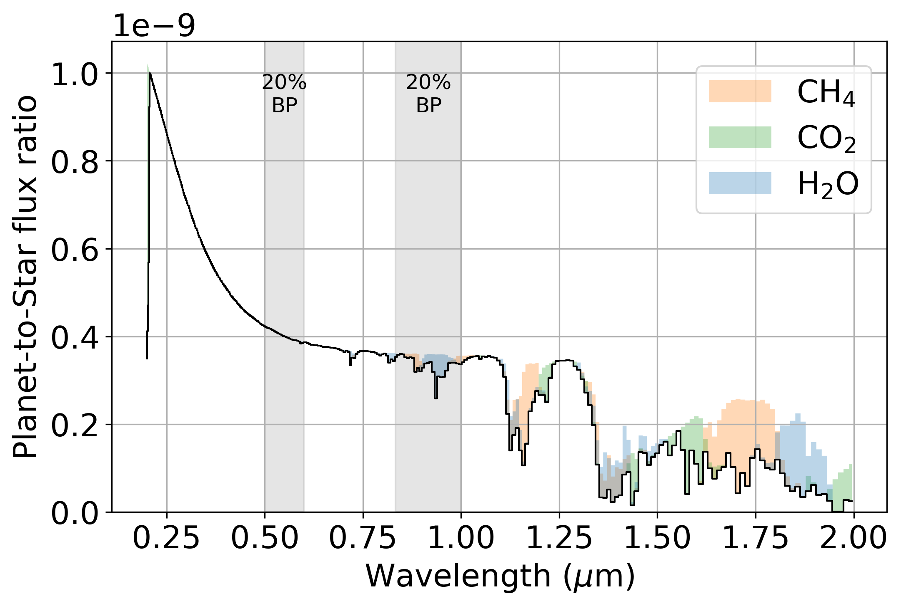

# Can LUVex identify an Archean Earth during the search for candidate exoEarths?

The LUVOIR final report argues for two main phases of the telescopes operation in its search for life

1. Detect a planet and search for water vapor at 0.94 $\mu$m (SNR = 5, R = 70). This will establish a list of habitable exoEarth candidates.

2. 

## Methods

## Results

## Conclusion
