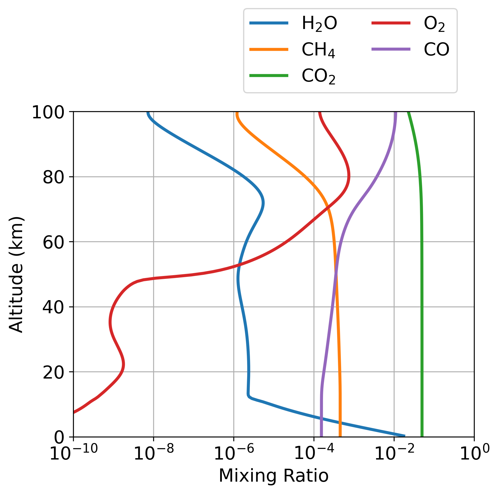
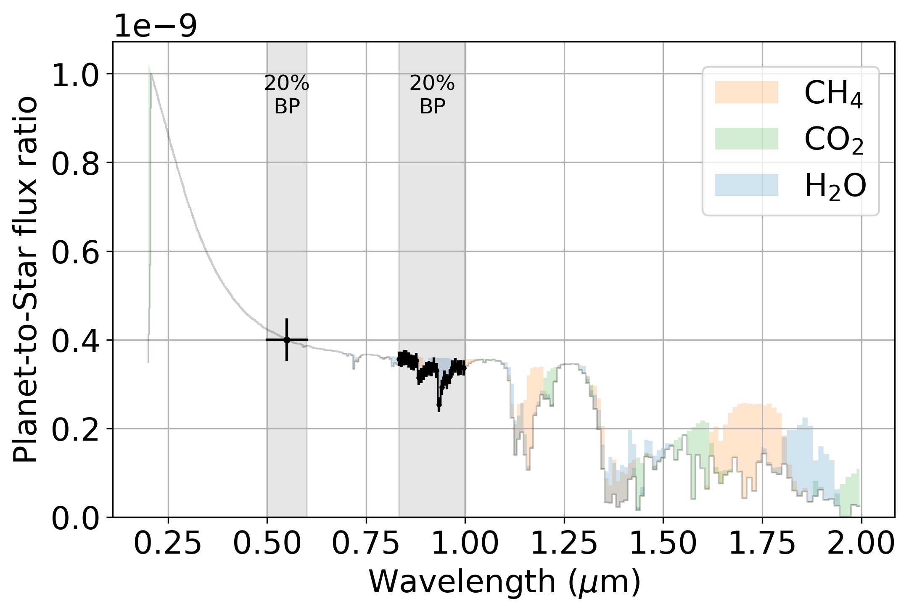
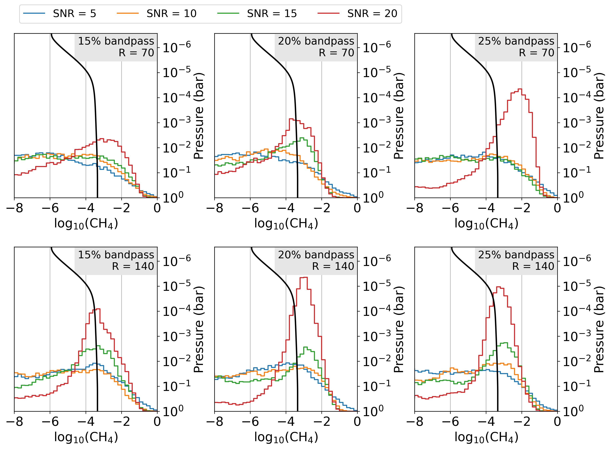
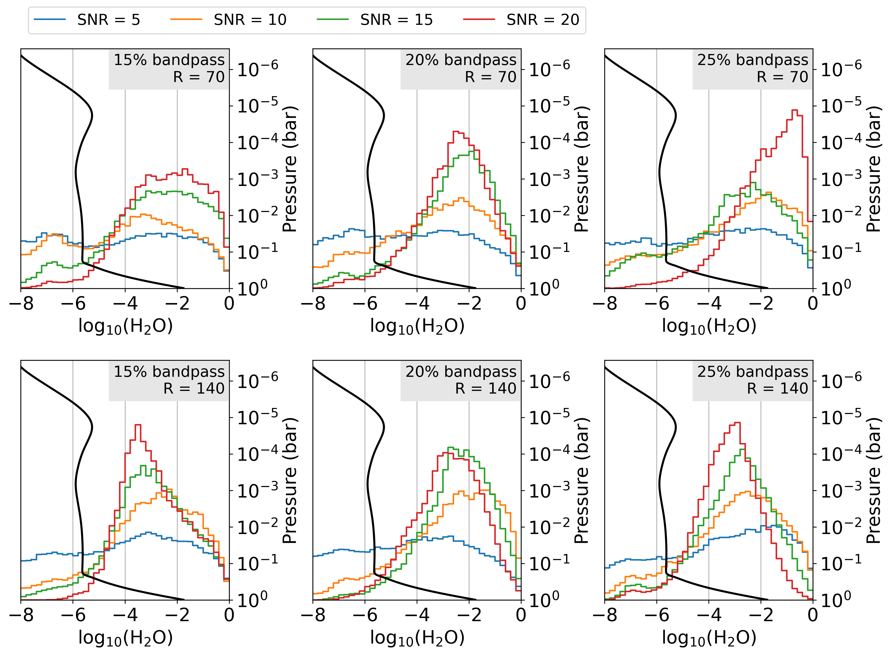

# Introduction

The LUVOIR final report argues for two main phases of telescope operations in its search for life on exoplanets:

1. A planet detection phase. Detect planets with photometry at 550 nm and do a single spectroscopy bandpass of each detected planet searching for the 0.94 $\mu$m water vapor feature. Detected planets with water vapor establish a list of habitable exoEarth candidates.

2. A planet characterization phase. Further observations are made to search for habitability and biosignatures on the exoEarth candidates identified in step (1).

During step (2), we must slowly piece together a spectrum, and our knowledge of the planet, in a sequence of bandpasses. The cornagraph on LUVex will likely not be capable of doing spectroscopy bandpasses ($B = \frac{\Delta \lambda_b}{\lambda}$) that span an entire channel (e.g. the visible channel spans 0.5 to 1.0 $\mu$m). Instead, we currently expect bandpasses to be on the order of ~15% to ~30%.

This limitation of LUVex brings up the following question: What is the most optimal sequence of bandpasses to most efficiently identify an inhabited or uninhabited planet? Efficiency is critical, because telescope observation time is limited and we want to allocate time in a way that allows us to learn the most about the likelihood of life on detected exoEarth candidates.

Shawn Domagal-Goldman, Giada Arney and others on the LUVex team are working on an optimal sequence of characterization bandpasses called "the biosignature decision tree". The idea is to do observations in a sequence which most rapidly identifies Earth-like biospheres during each geologic eon: The Archean, Proterozoic and Phanerozoic Earth.

Currently, the decision tree begins with the spectra acquired in step (1), which searches for the 0.94 $\mu$m water vapor feature. The decision tree suggests this same observation should be used to detect a methane rich atmosphere, analogous to the Archean Earth's. If methane is detected, then further targeted observations will aim to confirm the presence of an Archean Earth-like biosphere.

However, the bandpass extent, spectral resolution ($R = \frac{\lambda}{\Delta \lambda}$), and signal-to-noise ratio (SNR) required to detect methane with the spectra acquired in phase (1) is currently not known. We do not know the instrument requirements in order to carry out the first step of the biosignature decision tree.

To address this problem, I perform atmospheric retrievals on synthetic LUVex spectra of an Archean Earth twin. All retrieval use a single photometric observation at 0.5 to 0.6 $\mu$m, and a single spectroscopy bandpass which encompasses the 0.94 $\mu$m water feature. My goal is to determine the bandpass extent, spectral resolution, and SNR required to detect methane at the first step of "the biosignature decision tree" for a "nominal" Archean Earth twin.

# Methods and Results

We do synthetic retrievals on the "nominal" Archean Earth twin containing 455 ppm CH$_4$ (Figure \ref{fig:NomArchean}). We produced this atmosphere using a photochemical model with boundary conditions drawn from the literature [@Kharecha_2005; @Catling_2020]. For comparison, the Archean Earth could have had between ~100 ppm and ~1% methane [@Catling_2020]. Values greater than ~2000 ppm require either (1) biological fluxes that are challenging to reconcile with ecosystem modeling [@Thompson_2022], or (2) hydrogen escape at a rate lower than the diffusion limited rate [@Kharecha_2005; @Tian_2005].
 
{#fig:NomArchean width=75%}
 
This nominal Archean atmosphere is not rich with hydrocarbon aerosols because we assume $\mathrm{CO_2} = 5\%$, a value consistent with models of the geologic carbon cycle [@Krissansen_2018]. Hydrocarbon aerosols do not form until $\mathrm{CH_4}/\mathrm{CO_2} 	\gtrsim 0.1$. Additionally, we assume a temperature profile identical to Modern Earth in the troposhere and isothermal above the tropospause. Since our photochemical model assumes water saturation in the troposhere, our water column abundance, and therefore its spectral characteristics, should be approximately equal to Modern Earth's.

Figure \ref{fig:spectra} shows the planet's full phase reflectance spectrum. Grey shading indicates the approximate wavelengths were we will consider synthetic photometric and spectroscopy observations. The spectroscopic bandpass that ends at 1 $\mu$m contains about one and a half methane features on either side of the 0.94 $\mu$m water feature.
 
{#fig:spectra width=100%}

Figure \ref{fig:noise} is identical to Figure \ref{fig:spectra}, except is shows one of example of the synthetic data that we do atmospheric retrievals on later in the text. This example has one photometric observation between 0.5 and 0.6 $\mu$m with SNR = 7 at 0.98 $\mu$m, and one 20% spectroscopic bandpass that terminates at 1 $\mu$m with R = 140, and SNR = 20.

{#fig:noise width=100%}

We performed 24 atmospheric retrievals on synthetic data similar to those shown in Figure \ref{fig:noise}. For all retrievals we consider one photometric observation between 0.5 and 0.6 $\mu$m with SNR = 7, and one spectroscopic bandpass that terminates at 1 $\mu$m. For the spectroscopic observation, we consider 15%, 20%, and 25% bandpasses, R = [70, 140], and SNR = [5, 10, 15, 20] (for 0.98 $\mu$m). We assume the bandpass can no go beyond 1 $\mu$m, because the visible channel of the LUVex coronograph can not operate beyond this wavelength. We neglect observations that might be made with LUVex's near infrared channel. We retrieve N$_2$, O$_2$, H$_2$O, CO$_2$, O$_3$, CO, CH$_4$, H$_2$, surface pressure, surface albedo, planet radius, planet gravity, and several cloud properties. We assume either log-uniform or linear-uniform priors for all parameters.

Figure \ref{fig:CH4} shows retrieved methane posterior distributions for all bandpass extents, R, and SNR. A weak methane detection requires SNR = 20, either R = 70 or R = 140, and a 20% or 25% bandpass. The exception is the SNR = 20, R = 140, and 15% bandpass case in the lower left-hand plot, which also has a weak methane detection. A key result is that is SNR = 20 appears to be required for even a weak methane detection.

{#fig:CH4 width=100%}

Figure \ref{fig:H2O} shows the water vapor posterior distribution for all retrievals. Here, we find that SNR = 10 or greater, at any resolution and bandpass extent is sufficient for a weak water vapor detection. The LUVOIR final report says, "we require SNR = 5 on the continuum at R = 70 for water vapor detection." We find that perhaps slightly higher than SNR = 5 is required for weakly detect water vapor. This result is likely very sensitive to the surface temperature which could vary significantly for habitable planets (here we assume a surface temperture of 288 K).

{#fig:H2O width=100%}

All retrievals are mostly agnostic about the CO, CO$_2$, and O$_2$ concentrations, surface gravity, and surface albedo. A N$_2$ background atmosphere is favored over a H$_2$ atmosphere.

Interestingly, the retrieval disfavors O$_3$. The single photometric observation at ~550 nm can potentially indirectly rule out a O$_2$ rich atmosphere, especially if photometry SNR is closer to 5.

# References

